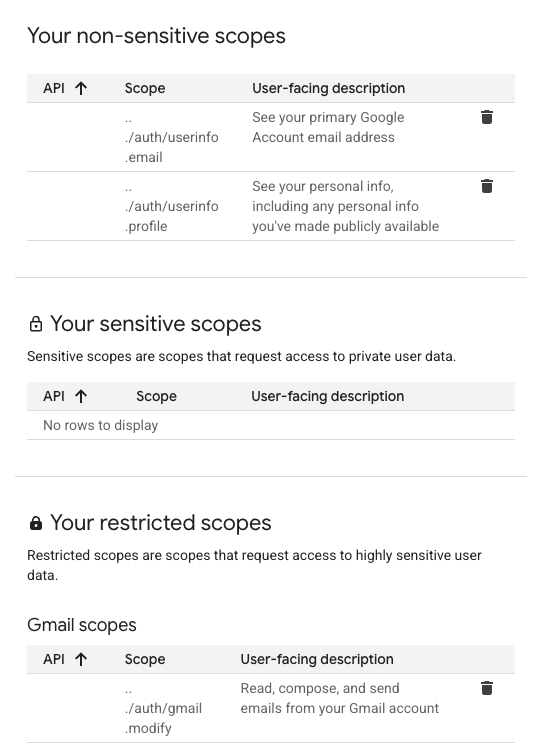
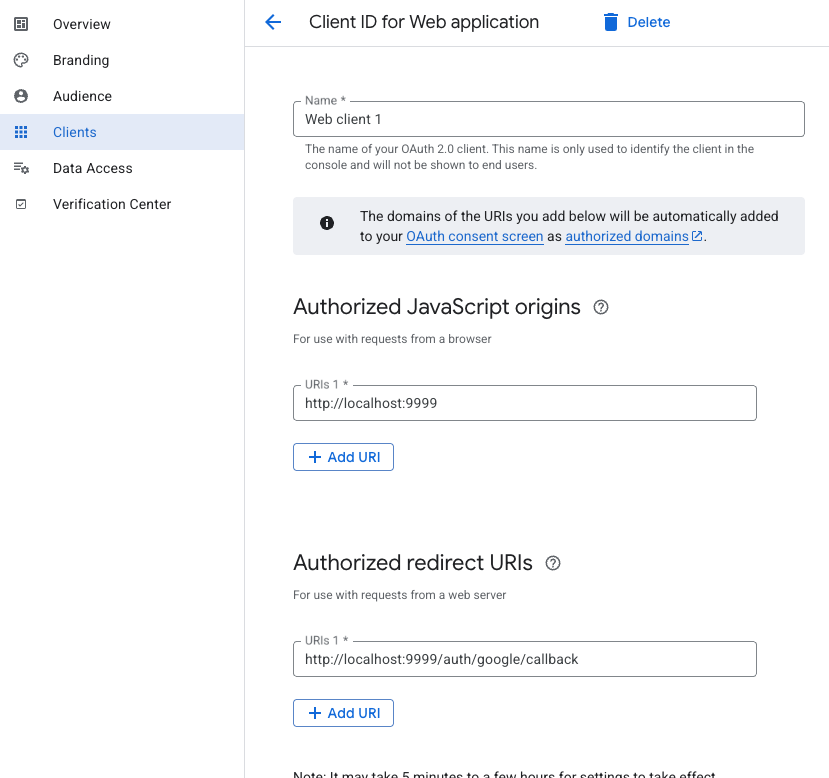

## 1. Bootstraping

- Make sure you have docker & docker-compose
  - Run `docker-compose up -d`
- Install goose - https://github.com/pressly/goose
  - Run `goose up`
  - Make sure the database migration works
- Bootstrap your google oauth2 provider based on this guide - https://permify.co/post/implement-oauth-2-golang-app/

  - Add these scopes under the `Data Access` tab
    

  - Should correspond to this scope that's present in golang code: `"https://www.googleapis.com/auth/gmail.modify", "https://www.googleapis.com/auth/userinfo.email", "https://www.googleapis.com/auth/userinfo.profile"`

  - Your auth client should look like this also
    

  - Under the `Audience` tab, add in your gmail that you'd like to access under `Test Users`

- For the golang server
  - Run `go mod download` to fetch dependencies

## 2. Running

- Run `go run cmd/sumnotes/main.go`
  - This'll run a gin http server on localhost:9999

## 3. Accessing

- Access localhost:9999 on your browser
  - Complete the entire login step for google consent screen
  - Login should be successful
  - When successful, go to localhost:9999/summaries
    - This should grab your latest email in markdown format (to be processed further for a agentic email distillation, still WIP!)
